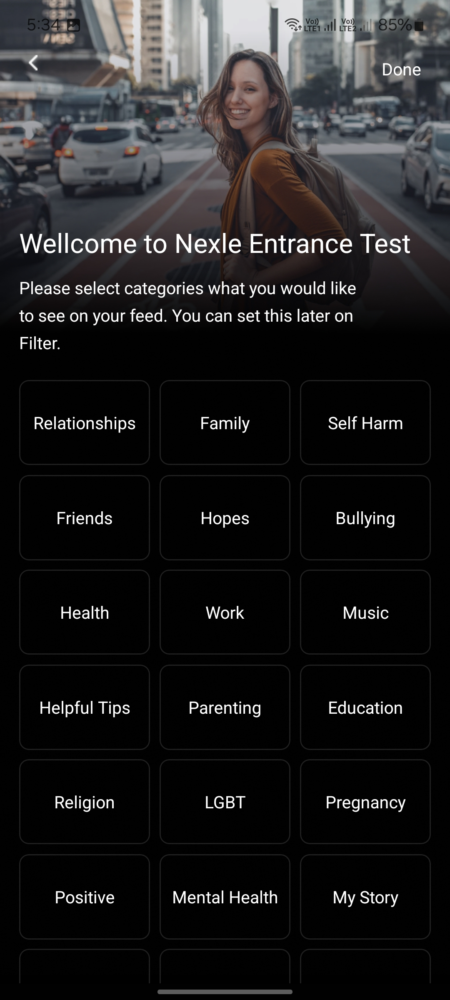
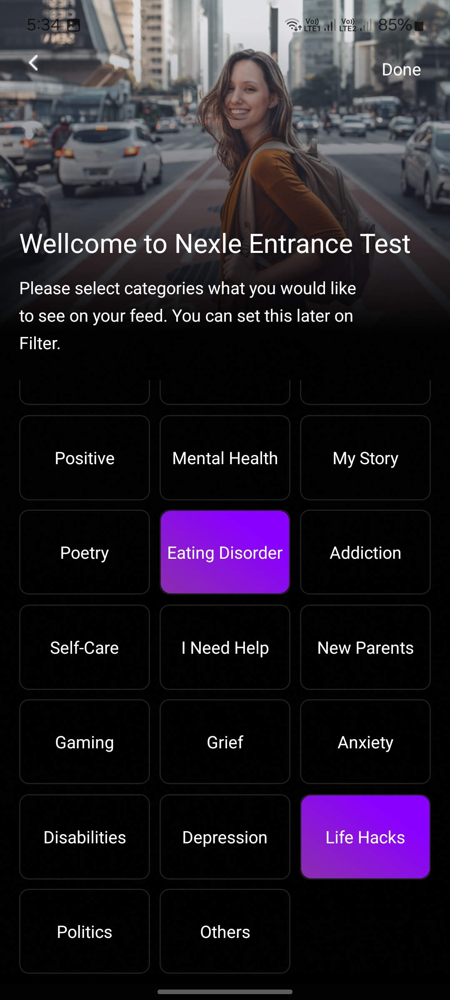

# Nexle Interview Project

**Author:** [Pham Nguyen Thai Khuong](https://github.com/thaikhuong62000)

## Screenshot

### Sign Up screen

|             Sign Up Default              |           Sign Up Form Filled            |
| :--------------------------------------: | :--------------------------------------: |
|  |  |

### Categories screen

|             Categories Default              |             Categories Selected             |
| :-----------------------------------------: | :-----------------------------------------: |
|  |  |

## Project Structure

```md
src
├─── assets
├─── components - Following the atomic design methodology
├─── config
├─── hooks
├─── navigators
├─── screens
├─── services - For data fetching & storing
├─── theme - Manage theme & utils for theme
├─── types - Custom type definition
├─── utils
```
